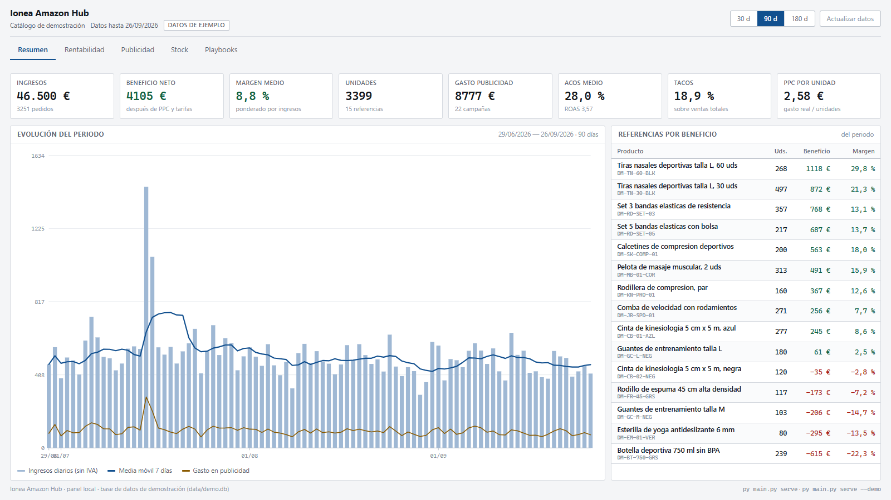
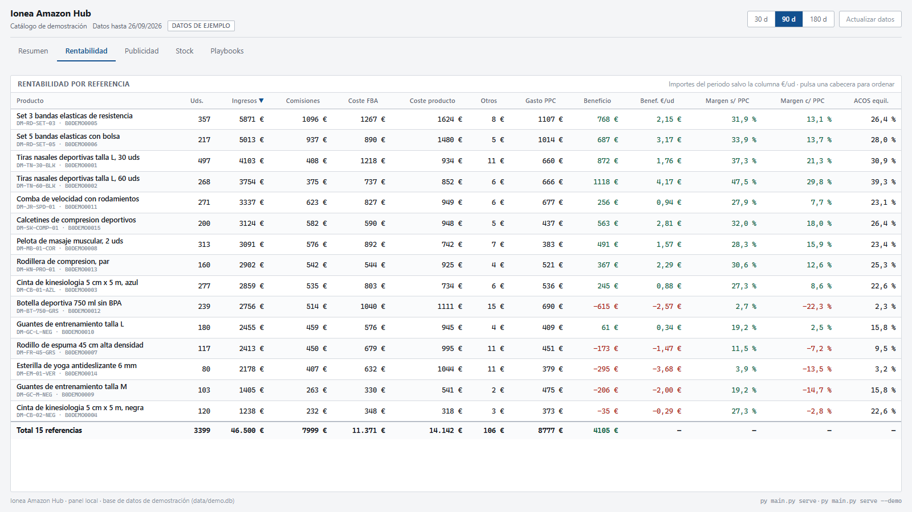
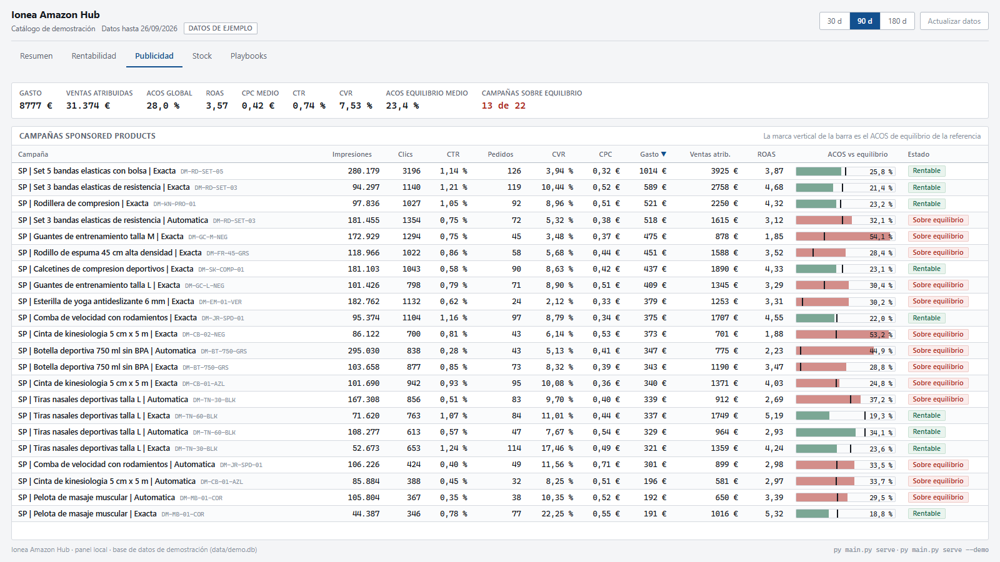
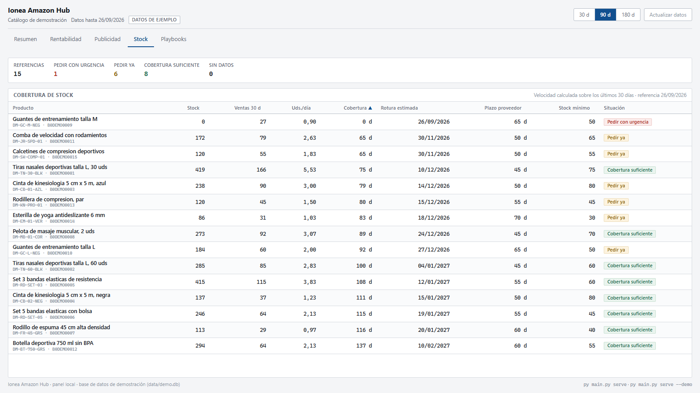

# Amazon Profitability Hub · Beneficio real por producto

Herramienta interna de Ionea Global (e-commerce en Amazon) que calcula cuánto gana de verdad cada producto, cruzando ventas, comisiones, costes y publicidad.

> Código privado. Las capturas usan el modo demostración, con datos ficticios.

## Qué resuelve

Amazon da informes de ventas, comisiones, inventario y publicidad por separado, y ninguno responde a la pregunta importante: **¿este producto gana dinero?** Esta herramienta lo calcula y lo enseña en un panel.

## Qué hace

- Descarga los datos de Amazon por **API**: ventas, comisiones, logística y publicidad.
- Calcula el **beneficio real por unidad** y el **margen con y sin publicidad** de cada producto.
- Calcula el **ACOS de equilibrio**: el gasto máximo en publicidad antes de perder dinero.
- **Previsión de stock**: días de cobertura, fecha estimada de rotura y aviso de reposición.
- **Resumen diario** con alertas y recomendaciones.
- **Modo demostración** con datos ficticios, que nunca toca los datos reales.

## El panel

| Vista | Qué muestra |
|---|---|
| **Resumen** | Ingresos, beneficio neto, margen, ACOS y evolución diaria |
| **Rentabilidad** | Una fila por producto con todos sus costes y su margen |
| **Publicidad** | Cada campaña comparada con el ACOS de equilibrio de su producto |
| **Stock** | Cobertura, rotura prevista y semáforo de reposición |

## Cómo está hecho

| | |
|---|---|
| **Lenguaje** | Python |
| **Integraciones** | Amazon Selling Partner API · Amazon Ads API · OAuth 2.0 |
| **Datos** | SQL · SQLite |
| **Tests** | pytest |

- **Proceso de datos por capas**: descarga, limpieza, cruce de fuentes y cálculo.
- **Credenciales fuera del código** y datos reales separados de los de demostración.

## En cifras

| 445 | 2 |
|:---:|:---:|
| tests automatizados | APIs de Amazon integradas |

## Mi papel

Diseño y desarrollo completo: integración con las APIs, modelo de datos, cálculos de rentabilidad, panel y tests. Desarrollo asistido por IA bajo mi especificación y revisión.

---

[Perfil](https://github.com/miquel-moreno) · [LinkedIn](https://www.linkedin.com/in/miquel-moreno-martinez)
